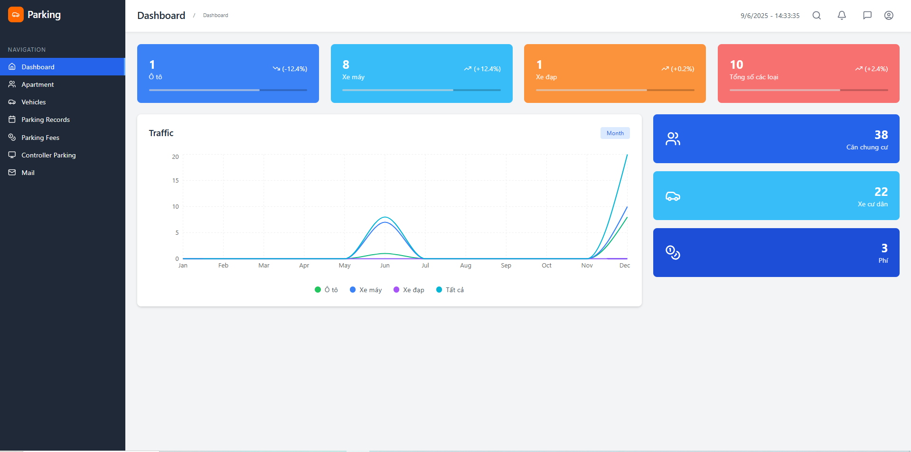
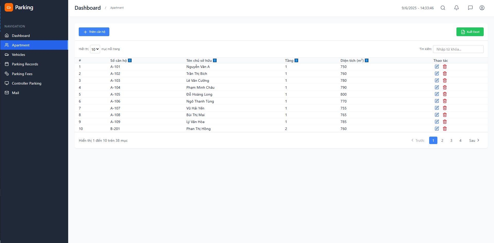
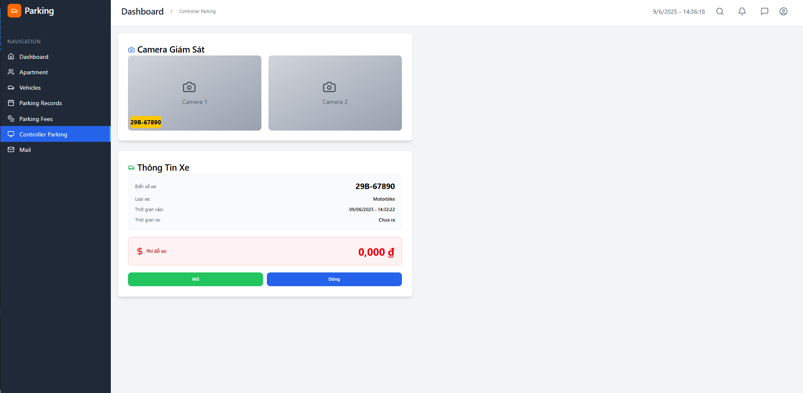
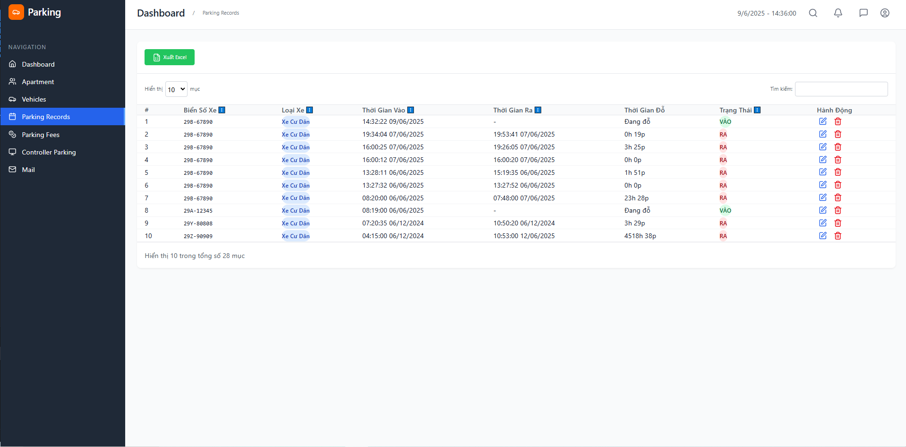
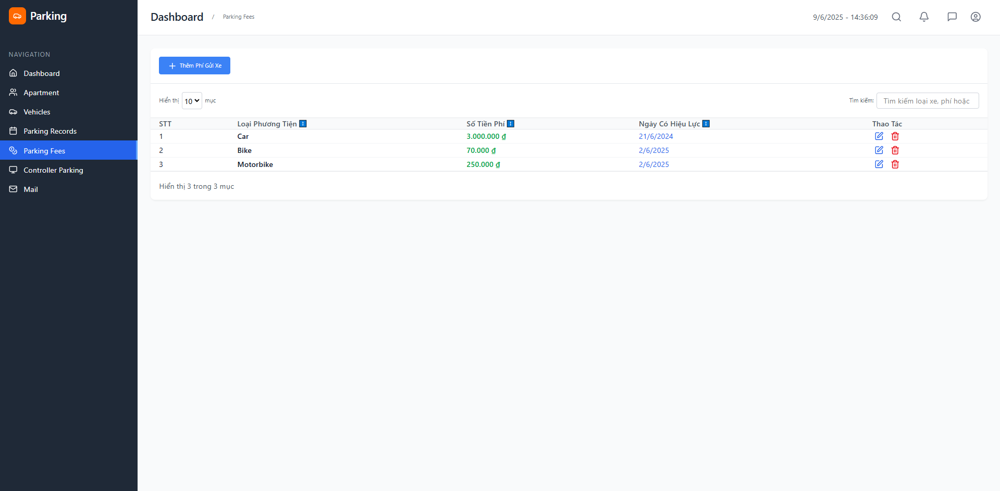
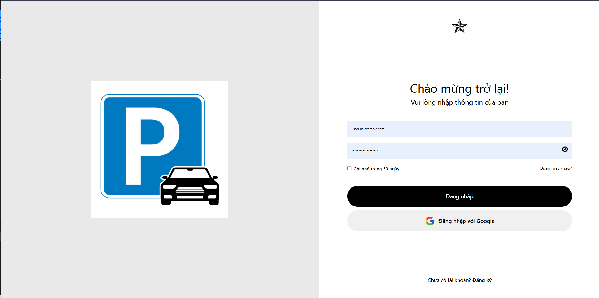
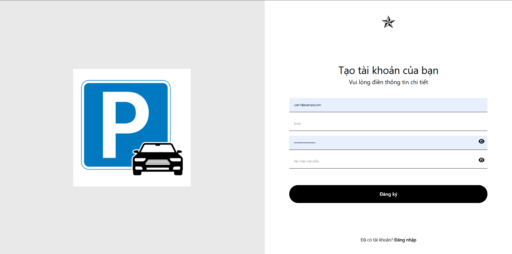
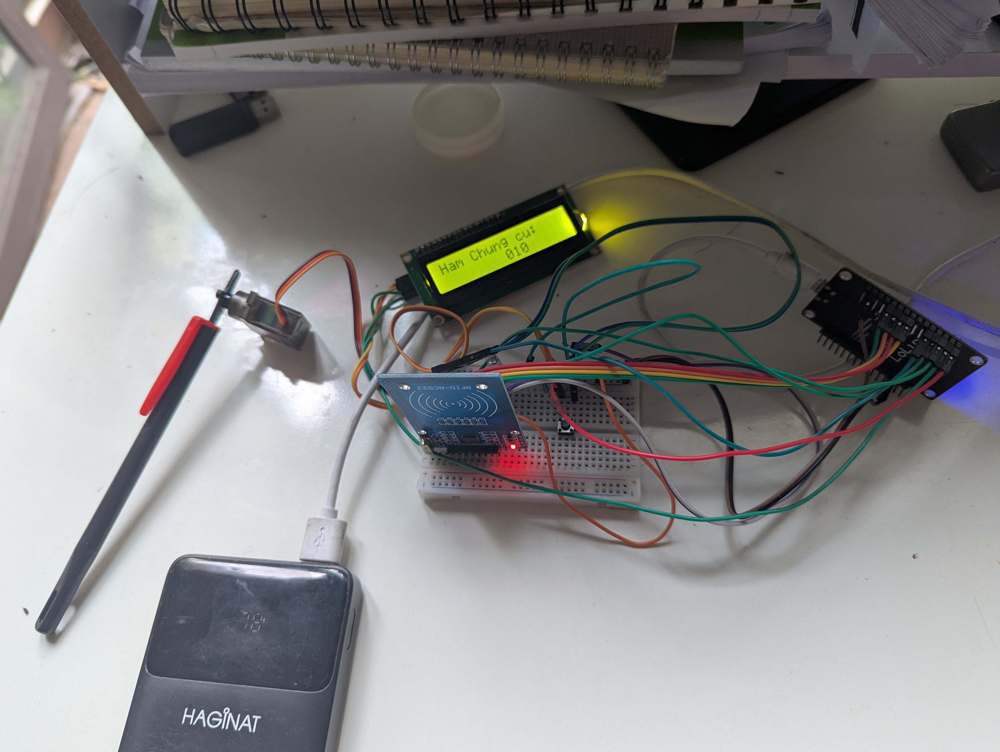

# Hệ Thống Quản Lý Đỗ Xe Thông Minh

## 📋 Giới thiệu

Dự án này xây dựng một hệ thống quản lý bãi đỗ xe thông minh cho chung cư, tích hợp kiểm soát ra/vào tự động sử dụng ESP8266 và RFID với giao thức MQTT. Hệ thống giúp ban quản lý dễ dàng theo dõi, thống kê, kiểm soát phương tiện cư dân và khách, đồng thời hỗ trợ các chức năng tự động hóa như mở cổng, ghi nhận vào/ra, tính phí đỗ xe, xuất báo cáo.

## ✨ Tính năng nổi bật

### 🏢 Quản lý căn hộ
- Thêm, sửa, xóa, tìm kiếm căn hộ
- Phân trang danh sách căn hộ
- Quản lý thông tin chi tiết từng căn hộ

### 👥 Quản lý cư dân & phương tiện
- Theo dõi thông tin cư dân
- Đăng ký xe (ô tô, xe máy, xe đạp)
- Phân loại và quản lý phương tiện

### 🚗 Ghi nhận vào/ra
- Lưu lịch sử vào/ra bãi xe theo thời gian thực
- Phân biệt xe cư dân

### 🔓 Kiểm soát cổng tự động
- Mở/đóng cổng qua giao diện web
- Tích hợp với ESP8266 và RFID
- Kiểm soát truy cập tự động

### 📊 Thống kê & báo cáo
- Biểu đồ lưu lượng xe ra/vào theo tháng
- Thống kê số lượng xe từng loại
- Xuất báo cáo file Excel


### 🔍 Tính năng khác
- Tìm kiếm, lọc, sắp xếp dữ liệu
- Phân trang cho dữ liệu lớn
- Cập nhật realtime

## 🛠️ Công nghệ sử dụng

### Frontend
- **ReactJS** - Thư viện JavaScript để xây dựng giao diện người dùng
- **Tailwind CSS** - Framework CSS utility-first
- **Bootstrap** - Framework CSS responsive
- **Recharts** - Thư viện biểu đồ cho React

### Backend
- **Node.js** - Môi trường runtime JavaScript
- **Express** - Framework web cho Node.js
- **MongoDB** - Cơ sở dữ liệu NoSQL

### Realtime & IoT
- **MQTT** - Realtime communication
- **ESP8266** - Vi điều khiển WiFi
- **RFID RC522** - Module đọc thẻ RFID

### Khác
- **RESTful API** - Kiến trúc API

## 📷 Hình ảnh giao diện

### 1. Trang Dashboard (Thống kê tổng quan)


### 2. Quản lý căn hộ


### 3. Quản lý phương tiện


### 4. Ghi nhận vào/ra bãi xe


### 5. Danh sách lưu lượng xe


### 6. Thông tin thu phí các loại xe


### 7. Đăng ký & đăng nhập tài khoản


### 8. Hình ảnh phần cứng 

> **Lưu ý:** Nếu chưa có thư mục `images`, hãy tạo và thêm ảnh chụp màn hình tương ứng để hiển thị đúng.

## 🚀 Hướng dẫn cài đặt & chạy

### Yêu cầu hệ thống
- Node.js (v14 trở lên)
- MongoDB (v4 trở lên)
- npm hoặc yarn

### 1. Clone dự án
```bash
git clone https://github.com/Kaistory/car-parking-management
cd car-parking-management
```

### 2. Cài đặt backend
```bash
cd backend
npm install
```

### 3. Cấu hình environment variables
Tạo file `.env` trong thư mục `backend`:
```env
PORT=5000
MONGODB_URI=mongodb://localhost:27017/parking_management
JWT_SECRET=your_jwt_secret_key
```

### 4. Khởi chạy backend
```bash
npm run dev 
```

### 5. Cài đặt frontend
```bash
cd ../frontend
npm install
```

### 6. Khởi chạy frontend
```bash
npm run dev 
```

### 7. Truy cập website
Mở trình duyệt và truy cập: [http://localhost:3000](http://localhost:3000)

## 📁 Cấu trúc thư mục

```
car-parking-management/
├── backend/                 # Source code backend
│   ├── controllers/         # Xử lý logic business
│   ├── models/             # Models MongoDB
│   ├── routes/             # Định tuyến API
│   ├── Mqtt-controller.js/ # Giao tiếp MQTT
│   └── server.js           # File khởi chạy server
├── frontend/               # Source code frontend
│   ├── src/
│   │   ├── components/     # React components
│   │   ├── pages/          # Trang giao diện
│   │   ├── context/        # Context
│   │   ├── services/       # API services
│   │   └── utils/          # Utility functions
│   ├── main.jsx    
│   ├── App.jsx         
│   └── public/             # Static files
├── esp8266_mqtt/           # Code cho ESP8266
└── README.md              # File này
```

## 🔧 Cấu hình thiết bị phần cứng

### ESP8266 + RFID Setup
1. Kết nối RFID RC522 với ESP8266
2. Cấu hình WiFi trong code Arduino
3. Upload code lên ESP8266
4. Kết nối với server backend qua HTTP/WebSocket

### Sơ đồ kết nối
```
ESP8266    <->    RFID RC522
3.3V       <->    3.3V
GND        <->    GND
D4         <->    SDA
D5         <->    SCK
D7         <->    MOSI
D6         <->    MISO
D3         <->    RST

ESP8266    <->    SERVO
VIN       <->      VCC
GND        <->    GND
D4          <->   IN

ESP8266    <->    LCD I2C
VIN       <->      VCC
GND        <->    GND
D2         <->    SDA
D1         <->    SCL

ESP8266 <-> Button
D0
```
## 📖 API Documentation

### Authentication
- `POST /api/auth/register` - Đăng ký tài khoản
- `POST /api/auth/login` - Đăng nhập
- `POST /api/auth/verify-otp` - Xác thực OTP

### Apartments
- `GET /api/apartments` - Lấy danh sách căn hộ
- `POST /api/apartments` - Thêm căn hộ mới
- `PUT /api/apartments/:id` - Cập nhật căn hộ
- `DELETE /api/apartments/:id` - Xóa căn hộ

### Vehicles
- `GET /api/vehicles` - Lấy danh sách phương tiện
- `POST /api/vehicles` - Đăng ký phương tiện mới
- `PUT /api/vehicles/:id` - Cập nhật phương tiện
- `DELETE /api/vehicles/:id` - Xóa phương tiện

### Parking Records
- `GET /api/parking/records` - Lấy lịch sử ra/vào
- `POST /api/parking/records` - Tạo bản ghi mới

## 🤝 Đóng góp

1. Fork dự án
2. Tạo branch tính năng (`git checkout -b feature/AmazingFeature`)
3. Commit thay đổi (`git commit -m 'Add some AmazingFeature'`)
4. Push to branch (`git push origin feature/AmazingFeature`)
5. Tạo Pull Request


## 📞 Liên hệ & hỗ trợ

- **Tác giả:** Dương Quang Khải
- **Email:** duongkhai222204pt@gmail.com
- **GitHub:** [https://github.com/Khaipropt](https://github.com/Khaipropt)


⭐ Nếu dự án này hữu ích, đừng quên cho một Star nhé!